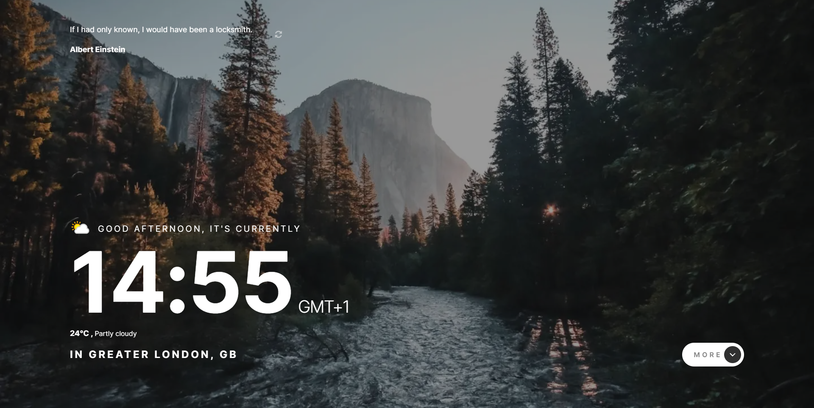
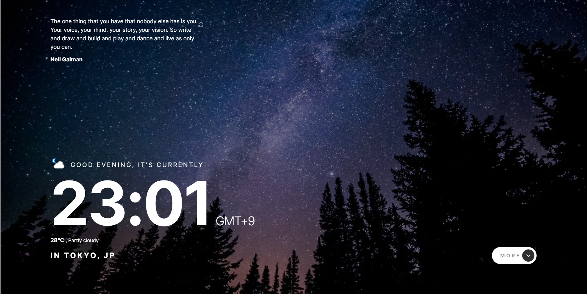
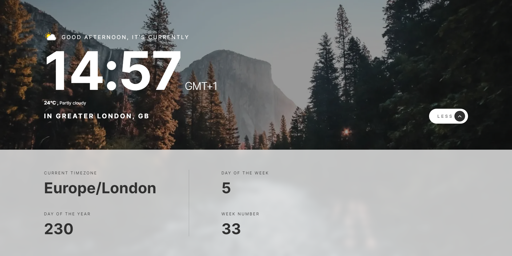
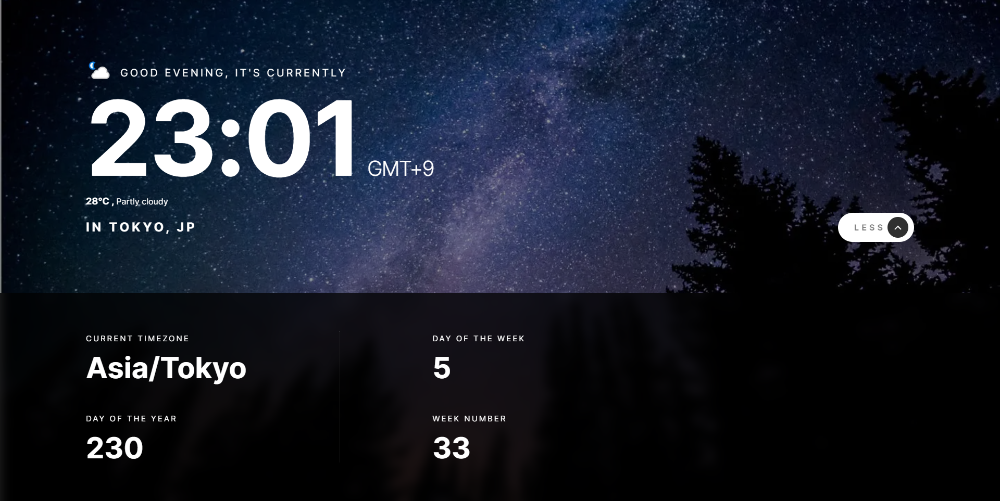
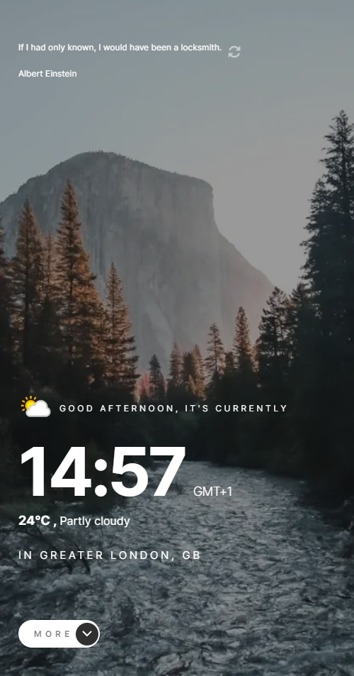
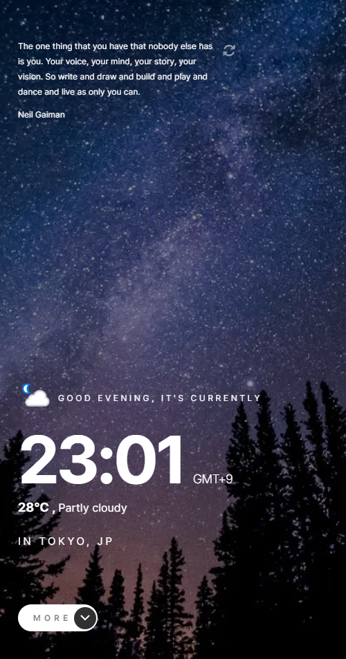
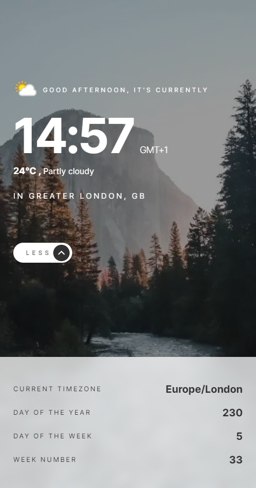
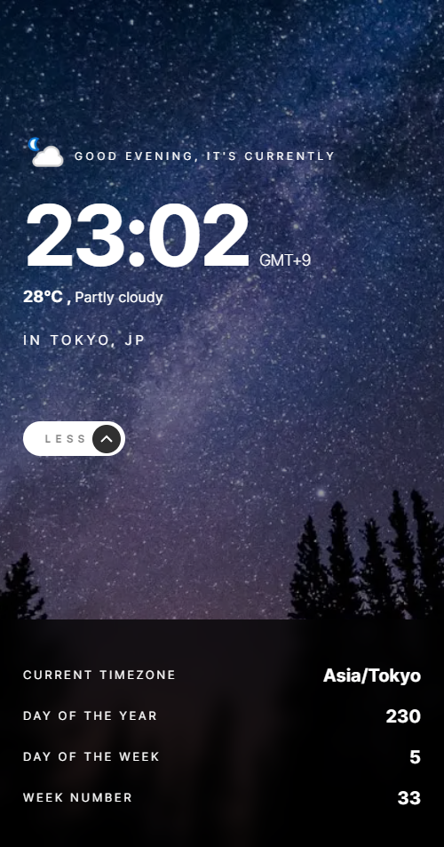

<h1 align="center">⌚🌩️Clock App</h1>

<h4 align="center">
    This project is a challenge that I took from <a href="https://www.frontendmentor.io/challenges/clock-app-LMFaxFwrM">frontendmentor.io </a> 
    which consists of building a clock app that shows the current time and if
    the user accepts the location request it will show the current temperature. 
</h4>
 

<h4 align="center">
    <a align="center" href="https://www.frontendmentor.io/solutions/clock-app-with-current-temperature-nYla-hZkJa">Front-end mentor challenge.</a> //
     <a align="center" href="https://clock-app-pied.vercel.app/">Clock App</a>
</h4>

 

<h6 align="center"> This project was created with:</h6>
 
 

    
    
    
    
 

  

<!-- Desktop -->
<h2 align="center">Desktop Version 🖥️</h2>

<h2 align="center">Mobile Version 📱</h2>

<!--Made By Gustavo J. Souza -->
